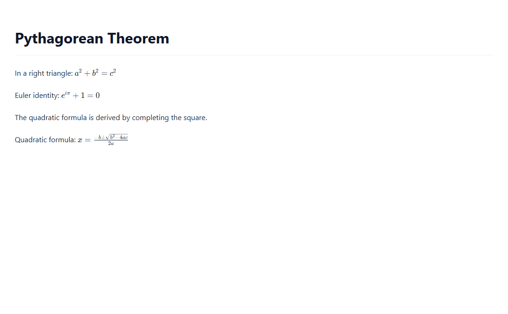

# 📄 DocExtract — استخراج المستندات العلمية (عربي + معادلات)


مشروع أكاديمي MVP: يحوّل المستندات المعقدة (PDF ممسوح ضوئياً، صور، DOCX...) إلى **Markdown + معادلات LaTeX** قابل للنسخ والتحرير، مع طبقة تصحيح بالذكاء الاصطناعي.

**التكلفة: 0$** — يعتمد على MinerU Cloud API المجاني (1000 صفحة/يوم) و Gemini API المجاني.

## لقطات من التطبيق

| الواجهة الرئيسية | المعاينة المنسقة (KaTeX) |
|:---:|:---:|
|  |  |

## البنية

```
ملف (PDF/صورة/DOCX/PPTX/XLSX)
        │
        ▼
┌─────────────────────────┐     ┌──────────────────┐
│ MinerU Cloud API        │ --> │ تصحيح Gemini AI   │
│ • Precision (Token)     │     │ إصلاح LaTeX      │
│ • Flash (بدون تسجيل)    │     │ حفظ العربية      │
└─────────────────────────┘     └──────────────────┘
        │
        ▼
واجهة Gradio: معاينة KaTeX (RTL) + محرر Markdown + نسخ/تنزيل .md/.tex/.docx
```

## التشغيل

### 1) التثبيت

```powershell
cd docextract
python -m venv .venv
.venv\Scripts\pip install -r requirements.txt
```

أو ببساطة شغّل `run.bat` (ينشئ البيئة ويثبّت كل شيء ثم يشغّل التطبيق).

### 2) المفاتيح (اختيارية لكن موصى بها)

انسخ `.env.example` إلى `.env` واملأ:

| المفتاح | من أين | لماذا |
|---|---|---|
| `MINERU_TOKEN` | https://mineru.net/apiManage/token | يرفع الحدود إلى 200MB/200 صفحة + دقة أعلى (vlm) — مجاني 1000 صفحة يومياً |
| `GEMINI_API_KEY` | https://aistudio.google.com/apikey | لزر التصحيح الذكي للمعادلات |

> بدون أي مفتاح يعمل التطبيق بوضع **Flash** (حتى 10MB / 20 صفحة).

### 3) التشغيل

```powershell
.venv\Scripts\python app.py
```

ثم افتح المتصفح على العنوان الظاهر (عادة http://127.0.0.1:7860).

## التقييم الأكاديمي

ضع المستند الأصلي (ground truth) وعينات مستخرجة في `evaluation/testset/` ثم:

```powershell
.venv\Scripts\python -X utf8 evaluation\evaluate.py truth.md extracted1.md extracted2.md
```

المقاييس:
- **CER** (Character Error Rate) لدقة النص — أقل = أفضل
- **Formula Accuracy** — نسبة المعادلات المطابقة (تشابه ≥ 90%) — أعلى = أفضل

### نتائج تجريبية فعلية (عينة إنجليزية بمعادلات)

| النظام | CER | دقة المعادلات |
|---|---|---|
| MinerU Flash خام | 0.50% | 0.00% |
| Flash + تصحيح Gemini | 0.50% | **100.00%** |
| MinerU Precision (vlm) | 0.50% | 50.00% |

الفجوة بين دقة النص وضعف المعادلات الخام — وكيف يسدها التصحيح بالذكاء الاصطناعي — هي **الإشكالية البحثية** التي يعالجها المشروع. (على عينات أكاديمية حقيقية أعقد تتسع الفجوة أكثر وتصبح النتائج أكثر دلالة).

## هيكل الكود

```
docextract/
├── app.py                    # واجهة Gradio (معاينة KaTeX RTL + تحرير + تصدير)
├── src/
│   ├── extractor_mineru.py   # Precision + Flash + fallback تلقائي
│   ├── corrector.py          # تصحيح LaTeX/عربي عبر Gemini
│   └── exporter.py           # تصدير .md/.tex/.docx (معادلات Word أصلية OMML)
├── evaluation/
│   ├── evaluate.py           # CER + Formula Accuracy
│   └── testset/              # العينات
├── tests/smoke.py            # اختبارات سريعة (تُستخدم في CI)
├── .github/workflows/ci.yml  # اختبار تلقائي عند كل push
├── docs/                     # لقطات الشاشة
├── LICENSE                   # MIT
├── requirements.txt
└── run.bat
```

## حدود معروفة (MVP)

- صور المستند المستخرجة تظهر كروابط (لا تُعرض داخلياً) — التركيز على النص والمعادلات
- تصدير `.docx` خالص بالبايثون: المعادلات تُحوَّل إلى **معادلات Word أصلية قابلة للتحرير** (OMML) عبر LaTeX → MathML → OMML
- تصدير `.tex` يعمل دائماً (قوالب)، ويتحول لتحويل كامل عبر pandoc إن كان مثبتاً
- خدمة MinerU مستضافة في الصين — قد تكون بطيئة أحياناً في أوقات الذروة
